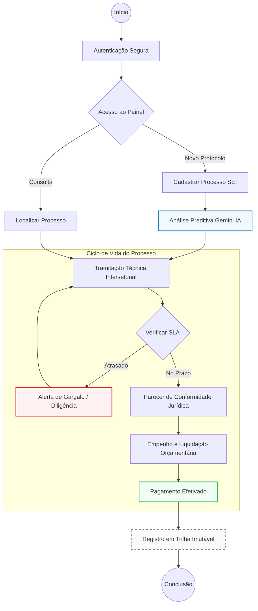

# Diagrama de Atividades - GESA Cloud
**Estado de Goiás - SES/SUBIPEI**

Este diagrama ilustra o fluxo operacional de um processo de emenda parlamentar dentro do ecossistema GESA Cloud, desde o protocolo inicial até a liquidação financeira.

## Descrição das Atividades Principais

1.  **Autenticação Segura**: O servidor acessa o sistema via e-mail corporativo. O sistema valida o perfil (RBAC) para liberar as funcionalidades correspondentes.
2.  **Análise Preditiva Gemini IA**: No momento do cadastro, a IA analisa o objeto da emenda e o histórico do parlamentar para prever possíveis impedimentos técnicos baseados no Decreto 10.634/2025.
3.  **Tramitação Técnica**: O processo é movido entre setores (ex: CEP, SUBIPEI, GCONV). Cada movimentação reinicia o cronômetro de SLA específico da unidade.
4.  **Verificação de SLA**: O motor de regras monitora o tempo de permanência. Se o prazo for excedido, o processo ganha destaque visual ("Status Térmico") e gera alertas para a gestão.
5.  **Registro em Trilha Imutável**: Toda e qualquer alteração de status ou despacho é gravada com carimbo de tempo e identidade do autor, garantindo a integridade para futuras auditorias.

---
**Instruções de Visualização:**
Este diagrama utiliza a sintaxe Mermaid. Você pode visualizar a renderização gráfica no [Mermaid Live Editor](https://mermaid.live/) ou imprimir este documento como PDF.
