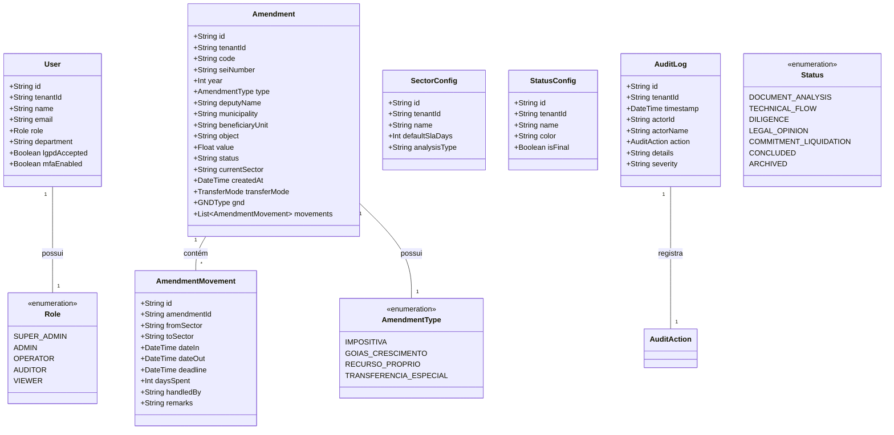

# Diagrama de Classes - GESA Cloud
**Estado de Goiás - SES/SUBIPEI**

Este diagrama representa a estrutura de dados e as entidades principais do sistema GESA Cloud, conforme definido no arquivo `types.ts`.

---

## Como gerar o PDF:
1. Abra este arquivo no visualizador do sistema.
2. Pressione **Ctrl + P** (ou Cmd + P no Mac).
3. Selecione a impressora **"Salvar como PDF"**.
4. Clique em **Salvar**.

*Nota: O diagrama acima utiliza a sintaxe Mermaid. Se o seu visualizador não renderizar o gráfico automaticamente, você pode copiar o código acima e colar no [Mermaid Live Editor](https://mermaid.live/) para exportar em alta resolução.*
