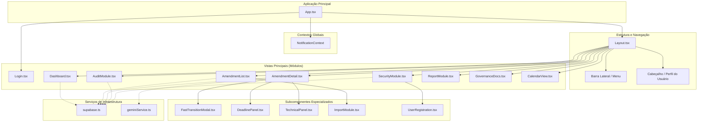

# Diagrama de Componentes - GESA Cloud
**Estado de Goiás - SES/SUBIPEI**

Este diagrama detalha a hierarquia e as interações entre os componentes React que compõem a interface do sistema GESA Cloud.

## Descrição dos Componentes Principais

1.  **App.tsx (Orquestrador)**: Gerencia o estado de autenticação, o roteamento lógico entre as visões e a sincronização inicial de dados com o Supabase.
2.  **Layout.tsx (Moldura)**: Define a estrutura visual persistente (Sidebar e Header) e envolve o conteúdo dinâmico.
3.  **Dashboard.tsx**: Componente de Business Intelligence que utiliza `recharts` para visualizar KPIs orçamentários e eficiência de trâmite.
4.  **AmendmentList.tsx**: Tabela de alta performance com filtros avançados, busca global e paginação para gestão de grandes volumes de processos SEI.
5.  **AmendmentDetail.tsx (Dossiê)**: O componente mais complexo, responsável por exibir a trilha de auditoria, calcular SLAs em tempo real e processar movimentações setoriais.
6.  **SecurityModule.tsx**: Gerencia o provisionamento de usuários, permissões RBAC e conformidade com a LGPD.
7.  **AuditModule.tsx**: Interface de visualização de logs imutáveis para órgãos de controle e auditoria.

---
**Instruções de Visualização:**
Este diagrama utiliza a sintaxe Mermaid. Você pode visualizar a renderização gráfica no [Mermaid Live Editor](https://mermaid.live/) ou imprimir este documento como PDF.
