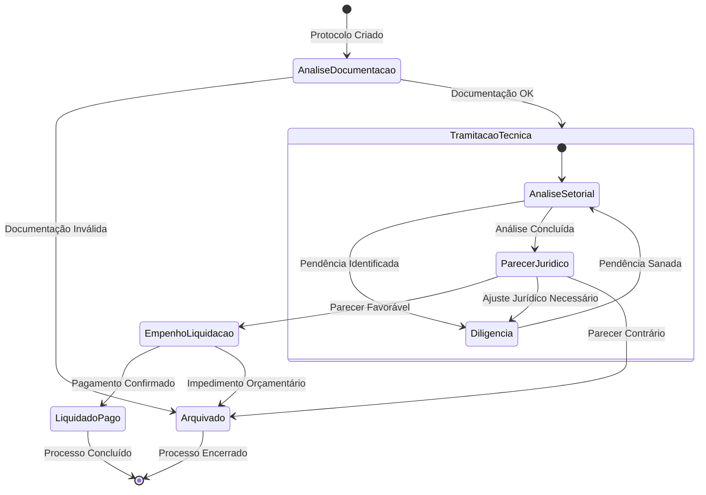

# Diagrama de Máquina de Estados - GESA Cloud
**Estado de Goiás - SES/SUBIPEI**

Este diagrama detalha o ciclo de vida de um processo de emenda parlamentar, ilustrando as transições de estado e as condições de fluxo dentro do sistema.

## Descrição dos Estados e Transições

### Estados Principais
1.  **Análise de Documentação**: Estado inicial onde a GESA verifica se o processo SEI contém todas as certidões e documentos exigidos pelo Decreto 10.634/2025.
2.  **Tramitação Técnica**: Estado composto onde o processo circula pelas unidades técnicas (ex: SUBIPEI, Gerências). Pode entrar em **Diligência** caso falte alguma informação técnica.
3.  **Parecer Jurídico**: O processo é submetido à GCONV/Procuradoria para validação da conformidade legal do repasse.
4.  **Empenho / Liquidação**: Fase de execução orçamentária onde o recurso é reservado e a despesa é reconhecida.
5.  **Liquidado / Pago**: Estado final de sucesso, onde o recurso foi efetivamente transferido ao município ou fundo beneficiário.
6.  **Arquivado**: Estado terminal para processos rejeitados, cancelados ou com impedimentos insuperáveis.

### Regras de Transição
-   **Imutabilidade**: Uma vez atingido o estado **Liquidado/Pago** ou **Arquivado**, o sistema bloqueia edições retroativas para garantir a segurança jurídica (Audit Lock).
-   **Retroalimentação**: O fluxo permite o retorno para **Diligência** a partir de quase qualquer fase técnica ou jurídica, garantindo que o processo só avance com total conformidade.

---
**Instruções de Visualização:**
Este diagrama utiliza a sintaxe Mermaid. Você pode visualizar a renderização gráfica no [Mermaid Live Editor](https://mermaid.live/) ou imprimir este documento como PDF.
