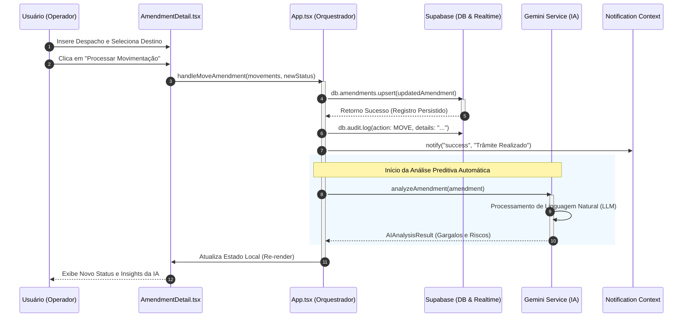

# Diagrama de Sequência - GESA Cloud
**Estado de Goiás - SES/SUBIPEI**

Este diagrama detalha a interação entre os componentes do sistema durante o processo de **Tramitação de um Processo SEI com Análise de IA**.

## Descrição do Fluxo de Mensagens

1.  **Interação Inicial**: O usuário preenche os dados de trâmite na interface de detalhes do processo.
2.  **Orquestração**: O `App.tsx` recebe a solicitação e coordena as múltiplas chamadas de serviço necessárias para manter a integridade do sistema.
3.  **Persistência**: A primeira ação crítica é salvar o novo estado no **Supabase**. O sistema utiliza uma estratégia de "Optimistic UI" ou aguarda a confirmação do banco para garantir que a trilha de auditoria seja fidedigna.
4.  **Auditoria**: Imediatamente após o sucesso do trâmite, um log de auditoria é gerado. Este log é imutável e serve para conformidade jurídica.
5.  **Análise de IA (Gemini)**: O sistema dispara uma análise automática. O Gemini Pro lê o contexto do processo (valor, objeto, setor atual) e retorna um `AIAnalysisResult` contendo a probabilidade de conclusão e identificação de gargalos.
6.  **Feedback em Tempo Real**: O usuário recebe uma notificação visual ("Plush Notification") e a interface é atualizada com os novos dados e os insights gerados pela inteligência artificial.

---
**Instruções de Visualização:**
Este diagrama utiliza a sintaxe Mermaid. Você pode visualizar a renderização gráfica no [Mermaid Live Editor](https://mermaid.live/) ou imprimir este documento como PDF.
