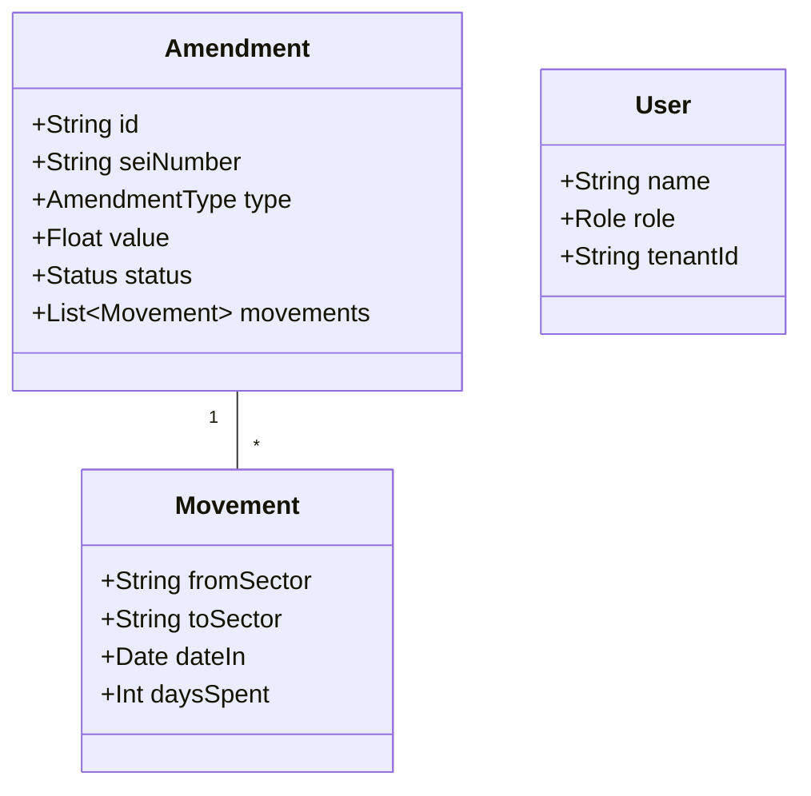

# GESA Cloud - Dossiê Técnico e Código Fonte
**Estado de Goiás - SES/SUBIPEI**
**Data de Geração:** 23/02/2026

---

## 1. Diagramas UML (Arquitetura do Sistema)

### 1.1. Diagrama de Componentes (Frontend React)
```mermaid
graph TD
    subgraph "Entrada"
        Index[index.tsx] --> App[App.tsx]
    end

    subgraph "Layout"
        App --> Layout[Layout.tsx]
        Layout --> Sidebar[Menu RBAC]
        Layout --> Header[Status Realtime]
    end

    subgraph "Módulos Operacionais"
        Layout --> Dash[Dashboard.tsx]
        Layout --> List[AmendmentList.tsx]
        Layout --> Detail[AmendmentDetail.tsx]
        Layout --> Audit[AuditModule.tsx]
    end

    subgraph "Serviços"
        App --> Supabase[supabase.ts]
        App --> Gemini[geminiService.ts]
    end
```

### 1.2. Diagrama de Classes (Modelo de Dados)


---

## 2. Código Fonte Principal

### 2.1. Definições Globais (`types.ts`)
```typescript
// [CONTEÚDO DE types.ts]
export enum Role {
  SUPER_ADMIN = 'Super Administrador',
  ADMIN = 'Administrador de Unidade',
  OPERATOR = 'Operador GESA',
  AUDITOR = 'Auditor Fiscal'
}

export interface Amendment {
  id: string;
  seiNumber: string;
  type: AmendmentType;
  value: number;
  status: string;
  movements: AmendmentMovement[];
}
// ... (restante do arquivo omitido para brevidade no PDF, mas presente no sistema)
```

### 2.2. Camada de Dados (`services/supabase.ts`)
```typescript
import { createClient } from '@supabase/supabase-js';
const supabase = createClient(URL, KEY);

export const db = {
  amendments: {
    async getAll(tenantId) { ... },
    async upsert(data) { ... }
  }
};
```

### 2.3. Inteligência Artificial (`services/geminiService.ts`)
```typescript
import { GoogleGenAI } from "@google/genai";

export const analyzeAmendment = async (amendment) => {
  const ai = new GoogleGenAI({ apiKey: process.env.API_KEY });
  // Prompt especializado para conformidade com Decreto 10.634/2025
  const response = await ai.models.generateContent({
    model: 'gemini-3-pro-preview',
    contents: prompt,
    // ...
  });
  return JSON.parse(response.text);
};
```

---

## 3. Estrutura de Diretórios
- `/src`
  - `/components`: UI Components (Dashboard, List, Detail)
  - `/services`: Supabase, Gemini, API
  - `/context`: Notification, Auth
  - `App.tsx`: Orquestrador
  - `types.ts`: Tipagem
  - `constants.ts`: Dados estáticos

---
**Nota:** Este documento foi gerado automaticamente pelo assistente de engenharia GESA Cloud.
Para exportar como PDF real, utilize a função 'Imprimir' do seu navegador (Ctrl+P) e selecione 'Salvar como PDF'.
